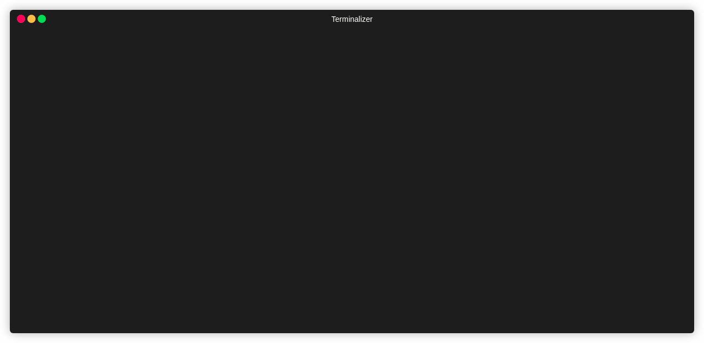

[](https://circleci.com/gh/jdamata/ecrgate)
[](https://codecov.io/gh/jdamata/ecrgate)
[](https://goreportcard.com/report/github.com/jdamata/ecrgate)
[](https://opensource.org/licenses/)

# ecrgate
ecrgate is used to add a docker image security gate to your CI pipeline.  
This flow of the utility is as follows:  
- Create the specified ECR repo (If it does not exist already)
- Build, tag and push your Dockerfile to the ECR repo. 
- Pull down the scan results of that image
- Compare them to the thresholds specified in flags (or defaults)
- Return exit code 1 if thresholds are too high
- (Optional) Delete the docker image from the ECR repo if the scan results exceed the threshold

## Installation

Linux:
```bash
wget https://github.com/jdamata/ecrgate/releases/latest/download/ecrgate-linux-amd64
chmod u+x ecrgate-linux-amd64
mv ecrgate-linux-amd64 ~/bin/ecrgate
```

Mac:
```bash
wget https://github.com/jdamata/ecrgate/releases/latest/download/ecrgate-darwin-amd64
chmod u+x ecrgate-darwin-amd64
mv ecrgate-darwin-amd64 ~/bin/ecrgate
```

## Requirements
- Docker
- AWS credentials

Sample IAM policy:
```
{
  "Version": "2012-10-17",
  "Statement": [
    {
      "Sid": "Stmt1585513157885",
      "Action": [
        "ecr:BatchDeleteImage",
        "ecr:CreateRepository",
        "ecr:DescribeImageScanFindings",
        "ecr:DescribeRepositories",
        "ecr:GetAuthorizationToken",
        "ecr:PutImageScanningConfiguration",
        "ecr:PutImageTagMutability"
      ],
      "Effect": "Allow",
      "Resource": "*"
    }
  ]
}
```

## Flags
--repo is the only required flag.

```bash
$ go run main.go --help
Build, push and gate docker image promotion to ECR

Usage:
  ecrgate [flags]

Flags:
  -a, --accounts strings    List of AWS account ids to allow pulling images from
  -c, --clean               Delete image from ECR if scan fails threshold
      --critical int        Acceptable threshold for CRITICAL level results
  -d, --dockerfile string   Path to Dockerfile (default ".")
  -h, --help                help for ecrgate
      --high int            Acceptable threshold for HIGH level results (default 3)
      --info int            Acceptable threshold for INFORMATIONAL level results (default 25)
      --low int             Acceptable threshold for LOW level results (default 10)
      --medium int          Acceptable threshold for MEDIUM level results (default 5)
  -r, --repo string         ECR repo to create and push image to
  -t, --tag string          Docker tag to build (default "latest")
      --version             version for ecrgate
```

## Examples
```bash
ecrgate --repo joel-test
```
- Use local dir as Dockerfile path
- Push docker image with tag latest
- Use default threshold levels

```bash
ecrgate --repo joel-test --dockerfile example/ --tag $(git describe --abbrev=0 --tags) --clean
```
- Use ubuntu/ as Dockerfile path
- Use the latest git tag as docker image tag
- Use default threshold levels
- Purge image from ecr repo if scan fails threshold

```bash
ecrgate --repo joel-test --dockerfile example/ --tag $(git rev-parse --short HEAD) --clean \
    --info 10 --low 5 --medium 3 --high 2 --critical 1
```
- Use ubuntu/ as Dockerfile path
- Use the short git sha as the docker image tag
- Use specified threshold levels
- Purge image from ecr repo if scan fails threshold

## Running

**Failing example:**


**Passing example:** 


